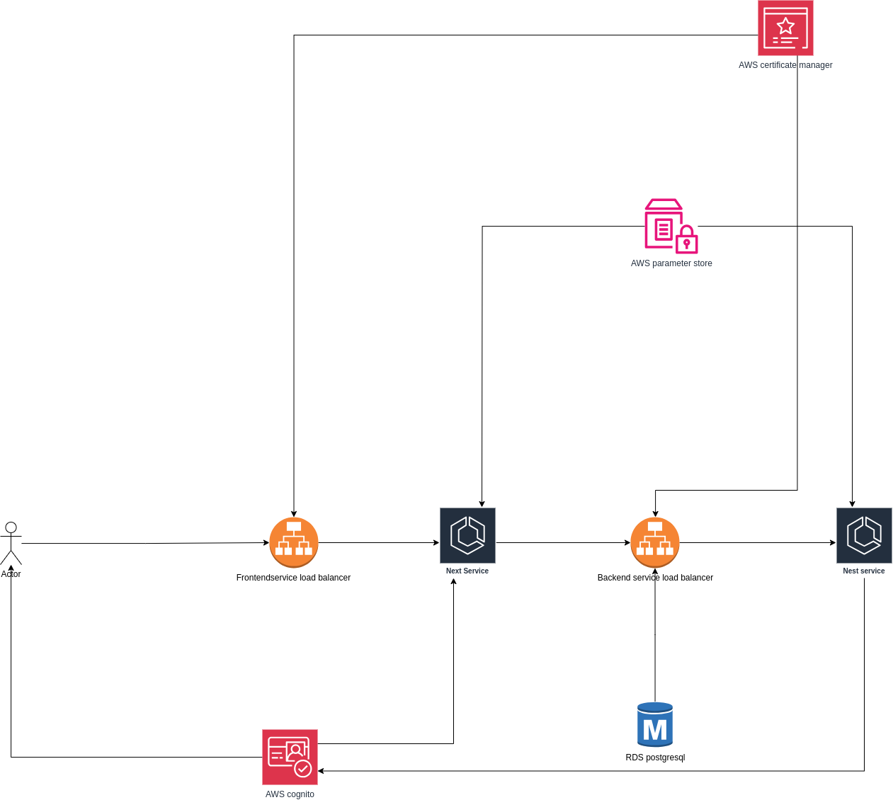

💬 Chat Application - Real-time, Scalable, and Secure

Full-stack chat application built with a modern tech stack, designed for scalability and security. This project demonstrates a robust and practical example of cloud-native development.

👉 [Click here to view the live site](https://livechatapp-1351133795.us-east-2.elb.amazonaws.com/)

🧩 ⚙️ Overview
This project delivers a complete real-time chat experience, leveraging the power of Next.js for a responsive frontend and NestJS for a robust and scalable backend. The application is containerized using Docker, making deployments consistent and portable. It's deployed on AWS using ECS Fargate, providing serverless compute for easy scalability. Security is paramount, with authentication handled by AWS Cognito and secrets managed via AWS Systems Manager Parameter Store. Persistence is provided by PostgreSQL running on Amazon RDS. The entire project is managed via GitHub, including CI/CD with GitHub Actions.

This architecture is designed for:

Scalability: ECS Fargate and RDS allow the application to scale automatically to handle fluctuating user loads.

Security: Cognito provides robust user authentication and authorization. Parameter Store securely stores sensitive data. HTTPS ensures encrypted communication.

Maintainability: Docker containers and a well-defined CI/CD pipeline make updates and deployments easy and reliable.

Performance: Next.js delivers a fast and responsive user experience, while NestJS provides a performant and well-structured backend.

⚙️ Tech Stack - Best-in-Class Technologies
A carefully chosen selection of technologies ensures a modern, efficient, and maintainable application:

## 🧰 Tech Stack Overview

| **Category**        | **Technology**                    | **Description**                                                                 |
|---------------------|-----------------------------------|---------------------------------------------------------------------------------|
| **Frontend**        | Next.js                           | React framework for server-rendered and statically generated web applications. |
| **Backend**         | NestJS                            | Progressive Node.js framework for building efficient and scalable server-side apps. |
| **Authentication**  | AWS Cognito                       | Managed user authentication and authorization service.                         |
| **Database**        | Amazon RDS (PostgreSQL)           | Managed relational database service with PostgreSQL.                           |
| **Containerization**| Docker                            | Platform for building, shipping, and running applications in containers.       |
| **Orchestration**   | AWS ECS (Fargate)                 | Serverless compute engine for containers.                                      |
| **Load Balancing**  | AWS ALB + TLS (ACM)               | Distributes incoming traffic and provides secure HTTPS connections.            |
| **Secrets Mgt.**    | AWS Systems Manager Parameter Store | Secure storage for configuration data and secrets.                            |
| **CI/CD**           | GitHub Actions                    | Automates building, testing, and deploying the application.                    |
| **Version Control** | GitHub                            | Source code management and collaboration platform.                             |

🚀 Deployment Strategy - Automated and Reliable
The deployment process is fully automated, ensuring consistency and minimizing manual errors.

Containerization with Docker:

Both the Next.js frontend and NestJS backend are packaged into Docker containers using well-defined Dockerfiles.

Multi-stage builds are utilized (especially for the NestJS backend) to minimize the final image size, resulting in faster deployments and reduced resource consumption.

Continuous Integration and Continuous Deployment (CI/CD) with GitHub Actions:

Every code push to the master branch triggers the CI/CD pipeline.

CI (Continuous Integration) Pipeline:

Builds Docker images for both the frontend and backend.

Pushes the newly built images to Amazon ECR (Elastic Container Registry).

Backend service workflow file /.github/workflows/main.yml
Frontend service workflow file /.github/workflows/nest.yml

CD (Continuous Deployment) Pipeline:

Deploys the updated images to the respective ECS services. This ensures that the latest code is always running.

🧾 AWS Services Used - Cloud-Native Architecture
This application is built entirely on AWS, leveraging a suite of managed services for scalability, reliability, and security.

AWS REGION: OHIO

✅ Amazon RDS (PostgreSQL):

Provides a fully managed PostgreSQL database for storing user data, chat messages, and other application metadata.

Database credentials and connection strings are securely stored in AWS Parameter Store, preventing sensitive information from being exposed in the codebase.

✅ AWS ECS (Fargate):

Serverless compute for running the application containers. No need to manage servers!

Two separate ECS services are defined: one for the Next.js frontend and one for the NestJS backend. This allows for independent scaling and updates.

An Application Load Balancer (ALB) sits in front of the ECS services, routing traffic appropriately.

✅ AWS Application Load Balancer (ALB):

Handles incoming HTTPS requests, providing a secure entry point to the application.

An ACM (AWS Certificate Manager) TLS certificate is installed on the ALB to encrypt all traffic, ensuring data privacy.

✅ AWS Cognito:

Provides a fully managed user authentication and authorization service.

Uses a Hosted UI for a seamless and customizable user sign-up/sign-in experience.

The NestJS backend verifies JWT (JSON Web Token) tokens issued by Cognito to authorize API requests, ensuring that only authenticated users can access protected resources.

✅ AWS Parameter Store:

Provides secure storage for sensitive data, including:

Database connection strings

Cognito client IDs and secrets

Other environment-specific secrets

This keeps sensitive information out of the codebase and environment variables, enhancing security.

🔐 Authentication Flow (AWS Cognito) - Secure and User-Friendly
The authentication process is streamlined and secure, leveraging the power of AWS Cognito:

User Initiates Login: The user navigates to the login page within the Next.js application.

Redirection to Cognito: The user is redirected to the Cognito Hosted UI, a pre-built, customizable login page provided by AWS.

Authentication: The user enters their credentials (or signs up if they don't have an account). Cognito handles the authentication process.

Token Issuance: Upon successful authentication, Cognito issues an authentication token (JWT) to the user.

Redirection Back to Application: The user is redirected back to the Next.js application, with the authentication token included.

Token Storage and Usage: The Next.js frontend securely stores the token (e.g., in an HTTP-only cookie or local storage)

#TODO-> Token Validation and Authorization: The NestJS backend uses a guard or middleware to validate the JWT token on each incoming request. This verifies the token's authenticity and ensures that the user is authorized to access the requested resource. Invalid or expired tokens are rejected.

This flow ensures that only authenticated users can access protected parts of the application and that all communication is secure.

📁 Environment Variables
🧠 Backend (/chatappFE/.env)
Create a file named .env inside the backend folder with the following:

DB_HOST
DB_PORT
DB_USERNAME
DB_PASSWORD
DB_DATABASE

🌐 Frontend (/chatappbe/.env)
Create a file named .env.local inside the frontend folder with the following variables:

NEXT_PUBLIC_SOCKET_URL
NEXT_PUBLIC_CLIENT_ID
NEXT_PUBLIC_LOGOUT_URI
NEXT_PUBLIC_COGNITO_DOMAIN
NEXT_PUBLIC_AUTHORITY
NEXT_PUBLIC_REDIRECT_URI
NEXT_PUBLIC_RESPONSE_TYPE
NEXT_PUBLIC_SCOPE

cd chatappbe
npm run start:dev

cd chatappFE
npm run dev

🎉CICD setup

Make sure to add the secrets to github

## Limitations and Security Considerations

This project is a demonstration/prototype and has some limitations and areas for improvement, particularly regarding security and robustness.  Please consider these points before deploying or adapting this code for production use:

**1. Security:**

*   **Socket.IO Authentication:** The current authentication mechanism for Socket.IO connections is likely basic and needs to be significantly enhanced.  Consider implementing robust authentication and authorization, potentially using:
    *   JWT (JSON Web Tokens) for session management. - Needs to send the JWT rather than the user send data for connection username

**2. Testing:**

*   **Insufficient Test Coverage:**  Comprehensive test cases (unit, integration, and end-to-end) are currently lacking

**3. User Experience (UX):**

*   **Responsiveness:** 
The application's responsiveness on mobile devices needs improvement.  Ensure the UI is properly designed for various screen sizes and 

*   **Message Delivery Confirmation:** Users currently lack feedback on whether their messages were successfully sent and received.  Implement visual indicators (e.g., checkmarks, loading spinners) to provide clear confirmation of message status.  Consider implementing:
    *   "Sent" indicators.
    *   "Delivered" indicators (if possible, based on server-side confirmation).
    *   "Read" receipts (optional, but can enhance the user experience).
    *   Error messages for failed message delivery. - currently backend service does send the need to handle in FE
* **No Group Chat Feature** Currently, the application doesn't support group chat, limiting its functionality to one-on-one conversations.

**4. Features:**
* **Only show live users list:** Currently, the application show only a list of live users.

**5. Scalability and Performance:**

*   **User List Retrieval:**  The current method of fetching the active user list may not be efficient for a large number of users.  Consider using a caching mechanism, such as:
    *   **Redis:** Caching active user data in Redis would significantly improve the speed and efficiency of retrieving the user list, reducing the load on the database.  Implement a mechanism to:
        *   Add users to the Redis cache upon connection.
        *   Remove users from the cache upon disconnection.
        